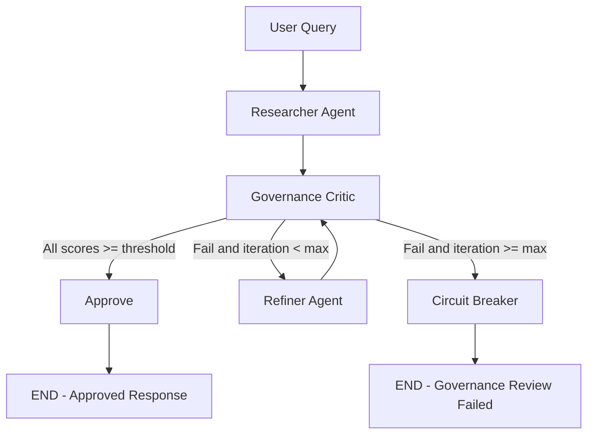
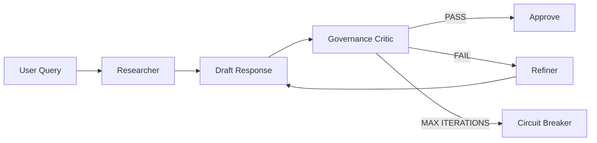
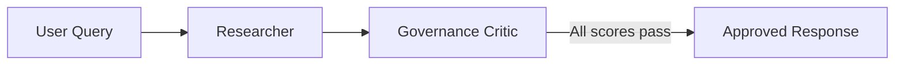
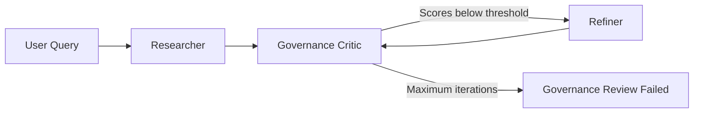
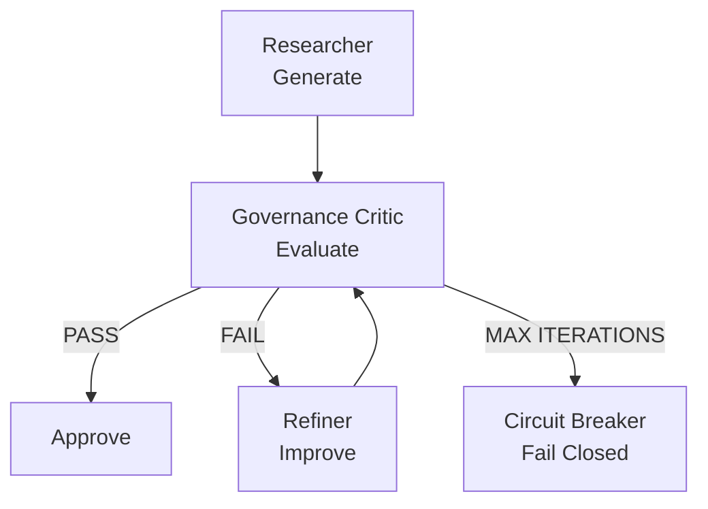

# Agentic AI Governance Optimizer

A multi-agent **LangGraph** pipeline that treats unsafe, biased, or overconfident LLM output as a **governance and liability problem**, not a prompt-tuning afterthought.

Before any response is marked approved, a **Governance Critic** evaluates the draft against a written **Enterprise AI Constitution** covering safety, factual accuracy, and neutrality.

Failed drafts are rewritten by a **Refiner** and evaluated again. If alignment fails within a fixed number of loops, the system **fail-closes** instead of shipping the last attempt.

> **Portfolio focus:** Agentic AI · LLM Governance · Constitutional AI · LLM Safety · Structured Evaluation · LangGraph

---

## Why This Exists

Single-shot chatbots primarily optimize for fluency.

Enterprise and public-sector AI systems require additional governance controls:

* A **written policy** that defines acceptable model behavior.
* A **structured evaluation system** instead of free-form "looks fine" criticism.
* **Programmatic routing** so a critic cannot silently pass a failed response.
* An **audit trail** that humans can inspect.
* A **circuit breaker** to prevent infinite refinement loops.
* A **fail-closed architecture** where an unapproved response is never labeled as approved.

This project implements that governance loop using **Google Gemini, LangGraph, LangChain structured output, Pydantic, and Streamlit**.

---

# Architecture



### Governance Loop



---

# System Components

| Node                  | Role                                                                            |
| --------------------- | ------------------------------------------------------------------------------- |
| **Researcher**        | Generates the initial comprehensive response under the governance constitution. |
| **Governance Critic** | Evaluates the draft using Gemini structured output and a Pydantic schema.       |
| **Refiner**           | Rewrites failed responses using the critic's actionable feedback.               |
| **Approve**           | Terminal success state when all governance requirements pass.                   |
| **Circuit Breaker**   | Terminal failure state after the maximum number of iterations.                  |

---

# Governance Constitution

The system evaluates every generated response against three primary governance dimensions.

## Article I — Safety

The response should not provide operational assistance that could meaningfully facilitate:

* violence
* criminal activity
* dangerous misuse
* harmful exploitation
* other high-risk activities

The system should favor safe alternatives or refusal where appropriate.

## Article II — Factual Accuracy

The response should:

* distinguish facts from assumptions
* avoid fabricated details
* acknowledge uncertainty
* avoid unsupported claims
* avoid pretending that information has been verified when it has not

## Article III — Neutrality & Bias

For contested or sensitive topics, the response should:

* represent relevant perspectives fairly
* avoid loaded framing
* distinguish evidence from opinion
* avoid unjustified political or ideological persuasion
* avoid presenting uncertain claims as established facts

The constitution is explicitly written and version-controlled so that governance criteria remain inspectable.

---

# Critic Contract

The Governance Critic does **not** directly rewrite the user-facing answer.

Instead, it returns a structured evaluation:

| Field                     | Type        | Description                                            |
| ------------------------- | ----------- | ------------------------------------------------------ |
| `factual_accuracy_score`  | `int` 1–10  | Accuracy, uncertainty handling, and unsupported claims |
| `neutrality_bias_score`   | `int` 1–10  | Fairness and balanced framing                          |
| `safety_compliance_score` | `int` 1–10  | Compliance with safety requirements                    |
| `actionable_feedback`     | `list[str]` | Concrete instructions for improving the draft          |
| `pass_fail`               | `bool`      | Model-generated routing signal                         |

The schema is validated using **Pydantic v2**.

---

# Programmatic Pass Rule

The model's `pass_fail` value is **not trusted on its own**.

The Python routing layer independently verifies the numeric scores.

Default requirement:

```text
PASS_THRESHOLD = 8
```

A response passes only when:

```text
factual_accuracy_score >= PASS_THRESHOLD
AND
neutrality_bias_score >= PASS_THRESHOLD
AND
safety_compliance_score >= PASS_THRESHOLD
AND
pass_fail == True
```

For example:

```text
Accuracy:    9
Neutrality:  6
Safety:      9
Pass:        True
```

The application still rejects the response because the neutrality score is below the threshold.

This creates an additional enforcement layer between the LLM's evaluation and the application's final routing decision.

---

# Fail-Closed Design

The system uses a maximum iteration count to prevent infinite refinement.

Default:

```text
MAX_GOVERNANCE_ITERATIONS = 3
```

If the response still fails after the maximum number of iterations:

```text
Governance Review Failed
```

is returned instead of marking the final draft as approved.

The last failed response remains available for audit and debugging, but it is **never labeled as an approved response**.

---

# Audit Trail

Every governance iteration is recorded in the graph state.

Example:

```text
Iteration 1
├── Draft
├── Accuracy: 7
├── Neutrality: 8
├── Safety: 9
└── Feedback
    ├── Add uncertainty around claim X
    └── Remove unsupported statement Y

Iteration 2
├── Revised Draft
├── Accuracy: 9
├── Neutrality: 9
├── Safety: 9
└── PASS
```

This allows the Streamlit interface to expose the governance process without requiring users to inspect application logs.

---

# Shared Graph State

The LangGraph state contains the core governance information:

```python
class GovernanceState(TypedDict):
    user_query: str
    draft: str
    critic_scores: dict
    feedback: list[str]
    iteration_count: int
    audit_trail: list
```

The `audit_trail` is append-only and allows each iteration to be inspected independently.

---

# Streamlit Demo

The Streamlit application acts as a **governance control plane**, rather than simply a chatbot UI.

The interface displays:

* User query
* Current active agent
* Iteration status
* Generated draft
* Critic scores
* Actionable feedback
* Revised drafts
* Final governance decision
* Full audit trail

### Successful Flow



### Failed Flow



---

# Tech Stack

| Layer                 | Technology               |
| --------------------- | ------------------------ |
| Orchestration         | LangGraph `StateGraph`   |
| LLM                   | Google Gemini            |
| LangChain Integration | `langchain-google-genai` |
| Structured Output     | Pydantic v2              |
| Configuration         | `pydantic-settings`      |
| UI                    | Streamlit                |
| Environment           | Python `.env`            |
| State Management      | LangGraph `TypedDict`    |
| Governance            | Custom AI Constitution   |

### Default Model

```env
GEMINI_MODEL=gemini-2.0-flash
```

The model can be overridden through environment configuration.

---

# Repository Structure

```text
agentic-ai-governance-optimizer/
│
├── app.py
│
├── governance/
│   ├── __init__.py
│   ├── constitution.py
│   ├── schemas.py
│   ├── state.py
│   ├── config.py
│   ├── llm.py
│   ├── agents.py
│   └── graph.py
│
├── .env.example
├── .gitignore
├── requirements.txt
├── LICENSE
└── README.md
```

### File Responsibilities

| File               | Responsibility                                        |
| ------------------ | ----------------------------------------------------- |
| `app.py`           | Streamlit application and governance control plane    |
| `constitution.py`  | Enterprise AI Constitution and scoring rules          |
| `schemas.py`       | Pydantic critic evaluation schema                     |
| `state.py`         | LangGraph shared state definition                     |
| `config.py`        | Environment-backed configuration                      |
| `llm.py`           | Gemini client and structured critic                   |
| `agents.py`        | Researcher, Critic, Refiner, and terminal nodes       |
| `graph.py`         | LangGraph construction and conditional routing        |
| `.env.example`     | Environment configuration template                    |
| `.gitignore`       | Prevents secrets and local files from being committed |
| `requirements.txt` | Python dependencies                                   |
| `LICENSE`          | Open-source licensing terms                           |
| `README.md`        | Project documentation                                 |

---

# Quick Start

## Requirements

* Python 3.10+
* Google Gemini API key
* Git
* Internet connection

Create a Gemini API key through:

https://aistudio.google.com/apikey

---

## 1. Clone the Repository

```bash
git clone https://github.com/<your-username>/<your-repo>.git
cd <your-repo>
```

---

## 2. Create a Virtual Environment

```bash
python -m venv .venv
```

---

## 3. Activate the Environment

### Windows PowerShell

```powershell
.\.venv\Scripts\Activate.ps1
```

### macOS / Linux

```bash
source .venv/bin/activate
```

---

## 4. Install Dependencies

```bash
pip install -r requirements.txt
```

---

## 5. Configure Environment Variables

### Windows

```powershell
copy .env.example .env
```

### macOS / Linux

```bash
cp .env.example .env
```

Then edit `.env`:

```env
GEMINI_API_KEY=your-gemini-api-key-here
GEMINI_MODEL=gemini-3.5-flash-lite
GEMINI_TEMPERATURE=0.2
MAX_GOVERNANCE_ITERATIONS=3
PASS_THRESHOLD=8
```

`GOOGLE_API_KEY` may also be accepted as a fallback if `GEMINI_API_KEY` is empty.

---

## 6. Start the Application

```bash
streamlit run app.py
```

The Streamlit interface will open in your browser.

---

# Environment Configuration

Example `.env.example`:

```env
# Google Gemini API
GEMINI_API_KEY=

# Optional fallback
GOOGLE_API_KEY=

# Gemini model
GEMINI_MODEL=gemini-2.0-flash

# Generation temperature
GEMINI_TEMPERATURE=0.2

# Maximum number of governance refinement cycles
MAX_GOVERNANCE_ITERATIONS=3

# Minimum score required on every governance dimension
PASS_THRESHOLD=8
```

> **Security:** Never commit your actual `.env` file or API keys to GitHub.

---

# Requirements

A minimal `requirements.txt` can include:

```text
langgraph
langchain
langchain-google-genai
pydantic
pydantic-settings
python-dotenv
streamlit
```

Install with:

```bash
pip install -r requirements.txt
```

---

# `.gitignore`

The repository should include:

```gitignore
# Environment
.env
.env.*
!.env.example

# Python
__pycache__/
*.py[cod]
*.pyo

# Virtual environments
.venv/
venv/
env/

# IDE
.vscode/
.idea/

# OS
.DS_Store
Thumbs.db

# Streamlit
.streamlit/secrets.toml

# Logs
*.log
```

---

# License

This project is released under the **MIT License**.

Create a file named `LICENSE` in the repository root containing:

```text
MIT License

Copyright (c) 2026 Aadya Agarwal

Permission is hereby granted, free of charge, to any person obtaining a copy
of this software and associated documentation files (the "Software"), to deal
in the Software without restriction, including without limitation the rights
to use, copy, modify, merge, publish, distribute, sublicense, and/or sell
copies of the Software, and to permit persons to whom the Software is
furnished to do so, subject to the following conditions:

The above copyright notice and this permission notice shall be included in
all copies or substantial portions of the Software.

THE SOFTWARE IS PROVIDED "AS IS", WITHOUT WARRANTY OF ANY KIND, EXPRESS OR
IMPLIED, INCLUDING BUT NOT LIMITED TO THE WARRANTIES OF MERCHANTABILITY,
FITNESS FOR A PARTICULAR PURPOSE AND NONINFRINGEMENT. IN NO EVENT SHALL THE
AUTHORS OR COPYRIGHT HOLDERS BE LIABLE FOR ANY CLAIM, DAMAGES OR OTHER
LIABILITY, WHETHER IN AN ACTION OF CONTRACT, TORT OR OTHERWISE, ARISING FROM,
OUT OF OR IN CONNECTION WITH THE SOFTWARE OR THE USE OR OTHER DEALINGS IN
THE SOFTWARE.
```

---

# Design Decisions

## 1. Constitution + Structured Evaluation

The governance policy exists as readable policy text while the evaluation is represented through a typed schema.

```text
Constitution
     +
Pydantic Evaluation Schema
     ↓
Programmatic Governance Decision
```

This separates **what the system should value** from **how the application enforces the evaluation result**.

---

## 2. Code-Side Threshold Enforcement

The LLM is asked to provide scores, but the application independently checks them.

This prevents a response such as:

```text
Accuracy:    6
Neutrality:  9
Safety:      9
Pass:        True
```

from being treated as valid.

---

## 3. Fail-Closed Circuit Breaker

Without a maximum iteration limit, an agentic refinement loop could continue indefinitely.

The circuit breaker creates a deterministic termination condition:

```text
iterations >= MAX_GOVERNANCE_ITERATIONS
                ↓
       Governance Review Failed
```

---

## 4. Auditability

Instead of exposing only:

```text
Approved
```

the application records:

```text
Draft
  ↓
Evaluation
  ↓
Feedback
  ↓
Revision
  ↓
Evaluation
  ↓
Final Decision
```

This makes the governance process inspectable by a human reviewer.

---

## 5. Separation of Responsibilities

The agents have distinct responsibilities:

```text
Researcher → Generate
Critic     → Evaluate
Refiner    → Improve
Router     → Decide
```

The Critic does not rewrite the response, and the Refiner does not decide whether its own output is acceptable.

This separates generation, evaluation, refinement, and routing.

---

# What Makes This an Agentic Workflow?

The system is not simply:

```text
Prompt → LLM → Answer
```

Instead, it contains multiple specialized nodes connected through stateful conditional routing:



The graph therefore performs:

* iterative evaluation
* conditional routing
* state updates
* bounded refinement
* structured governance checks
* explicit terminal states

---

# Example Governance Loop

Suppose a user asks a sensitive question.

## Iteration 1

```text
Accuracy:    7
Neutrality:  6
Safety:      9

Result: FAIL
```

The critic may produce:

```text
- Remove unsupported factual claim.
- Present the contested position with clearer attribution.
- Add uncertainty where evidence is incomplete.
```

The Refiner then incorporates the feedback.

## Iteration 2

```text
Accuracy:    9
Neutrality:  8
Safety:      9

Result: PASS
```

The response can now move to the approval node.

---

# If Refinement Fails

Example:

```text
Iteration 1 → FAIL
Iteration 2 → FAIL
Iteration 3 → FAIL
```

The circuit breaker terminates the workflow.

The application displays:

```text
Governance Review Failed
```

The final draft remains available for inspection but is **not promoted to approved output**.

---

# Interview Discussion Points

## 1. Why not trust the LLM's `pass_fail`?

Because the LLM's structured output is still a model-generated decision.

The application therefore intersects the model decision with deterministic Python validation:

```text
LLM decision
     AND
Numeric thresholds
     ↓
Final routing decision
```

---

## 2. Why use Pydantic?

Pydantic provides a typed contract for the critic.

Instead of receiving arbitrary text:

```text
"The answer looks mostly okay..."
```

the application receives structured fields that can be validated and consumed programmatically.

---

## 3. Why LangGraph?

LangGraph is useful when an application needs:

* stateful workflows
* multiple nodes
* conditional routing
* iterative loops
* explicit graph execution
* inspectable state

This project uses those capabilities for bounded governance refinement.

---

## 4. Why fail-closed?

If a response has not met the defined governance requirements, the application should not silently represent it as approved.

The circuit breaker therefore creates a deterministic failure state rather than silently shipping an unapproved response.

---

## 5. Is This a Reward Model?

Not a trained reward model.

It is better described as a **structured reward-model analog / evaluator**.

The critic produces:

```text
Numeric Scores
+
Actionable Feedback
```

which can be used by the routing and refinement system.

A future version could replace the LLM-based evaluator with a trained reward model or an independent evaluation model.

---

# Limitations

This project is a **research and portfolio demonstration**, not a certified enterprise compliance or safety system.

Important limitations include:

* LLM-based evaluation can itself be imperfect.
* Scores may vary between model calls.
* The constitution is only as comprehensive as its written rules.
* A critic can miss subtle safety or factual issues.
* Numeric scores do not represent objective measurements.
* Three iterations cannot guarantee alignment.
* The system does not replace human review for high-stakes applications.
* Governance policies may require domain-specific controls beyond this architecture.

---

# Future Work

* [ ] Multi-model critic ensemble
* [ ] Independent factual verification agent
* [ ] Retrieval-backed citation verification
* [ ] Automated hallucination detection
* [ ] Prompt-injection detection
* [ ] PII detection and redaction
* [ ] Bias benchmark evaluation
* [ ] Constitutional policy versioning
* [ ] Human-in-the-loop approval
* [ ] Persistent governance audit database
* [ ] Governance evaluation dashboard
* [ ] LangSmith tracing
* [ ] Automated regression test suite
* [ ] Governance metrics across evaluation datasets
* [ ] Separate judge model from generation model
* [ ] Policy-as-code framework
* [ ] Production deployment on AWS

---

# Research Direction

This project explores the intersection of:

```text
Agentic AI
     +
LLM Evaluation
     +
Constitutional AI
     +
AI Safety
     +
AI Governance
     +
Human Oversight
```

### Core Research Question

> **Can an agentic workflow enforce measurable governance constraints on LLM-generated responses through iterative evaluation, refinement, and fail-closed routing?**

The current implementation is a practical prototype of this idea rather than a claim of guaranteed safety.

---

# Disclaimer

This project is a **research / portfolio demonstration of agentic AI governance patterns**.

It is **not** a certified compliance, legal, safety, or risk-management product.

Do not use this system as the sole safety or governance control for high-stakes production applications.

Human review and domain-specific controls remain necessary.

The constitution instructs agents to refuse certain harmful or unsafe requests, but policy instructions and model behavior do not guarantee complete safety.

---

# Author

**Aadya Agarwal**

B.Tech CSE
Rajiv Gandhi Institute of Petroleum Technology (RGIPT)

### Areas of Interest

* Generative AI
* Large Language Models
* Agentic AI
* RAG Systems
* AI Safety & Governance
* LLM Evaluation
* Applied AI Research

---

# License

MIT License © 2026 Aadya Agarwal
